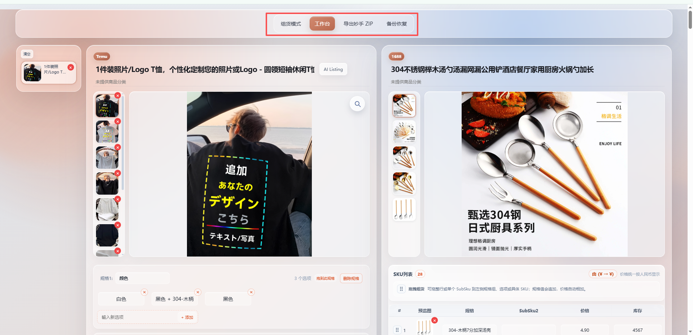
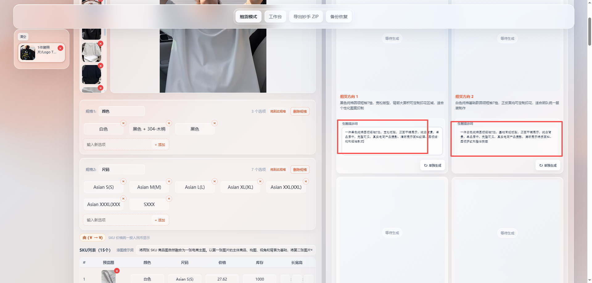

# 自动组货 8-28

Temu × 1688 本地智能组货工作台。项目把 Chrome 商品采集、商品缓存、图片缓存、CLIP 搜款、AI 组货、生图、SKU 编辑、备份恢复和妙手 ZIP 导出放到同一套本地流程里，适合反复采集、筛货、改图、组 SKU 和交付素材包。

## 界面预览

### 工作台



### 智能组货



## 这版重点

| 能力 | 说明 |
| --- | --- |
| 产品级图片缓存 | 图片和记录按 `平台/商品ID` 分目录保存，一个商品一个文件夹，删除单图、清空商品和 CRUD 定位更快 |
| 分段备份恢复 | JSON 恢复拆成 chunk 和 batch，前端显示恢复进度，避免大文件一次性丢给后端导致用户干等 |
| CLIP Top10 | 在 CLIP 模式下点击候选卡片的星标按钮，直接使用该商品下方 EN CLIP 关键词返回 Top 10 货源 |
| CLIP 并发加速 | CLIP 文本向量和 FAISS 搜索支持批处理，stdio worker 支持小规模并发，减少串行等待 |
| UI 状态锁 | 当前商品执行 CLIP Top10 时会锁住其他商品的重复提交，原商品左侧状态同步显示进行中/失败/完成 |
| 妙手 ZIP 导出 | Temu 商品可一键导出妙手素材 ZIP，标题、类目、价格、详情、SKU 尺寸等由本地数据生成 |
| 本地实时刷新 | 后端通过 SSE 推送商品、日志、任务和 CLIP 状态，前端按 ViewModel 重拉数据 |

## 技术栈

| 层 | 技术 |
| --- | --- |
| 前端 | Vue 3、Vite、原生 CSS |
| 后端 | Node.js、Express、SSE、Zod |
| 扩展 | Chrome Extension Manifest V3 |
| CLIP | Python、FAISS、本地 stdio worker |
| 缓存 | 本地 JSON、产品级图片目录、历史快照 |

## 快速开始

### 1. 安装依赖

```powershell
npm install
```

项目带有本地 runtime 时，通常可以直接运行；缺少依赖时再执行安装。

### 2. 创建私有配置

```powershell
Copy-Item server/config.example.json server/config.json
```

在 `server/config.json` 中填写 BeeAPI、Kimi、1688 搜图、CLIP 等私有配置。`server/config.json` 已被 `.gitignore` 忽略，不会提交 API Key。

### 3. 启动

```powershell
npm run dev
```

启动后访问：

| 地址 | 用途 |
| --- | --- |
| `http://127.0.0.1:5173` | 工作台 |
| `http://127.0.0.1:3000/api/v1` | 本地 API |
| `http://127.0.0.1:5173/server/logs` | 请求日志页 |

也可以双击 `启动.bat` 启动本地服务。

## Chrome 扩展加载

1. 打开 `chrome://extensions/`。
2. 开启“开发者模式”。
3. 点击“加载已解压的扩展程序”。
4. 选择 `extension/` 文件夹，不要选择项目根目录。
5. 刷新 Temu 或 1688 商品详情页。

支持页面：

| 平台 | 示例 |
| --- | --- |
| Temu | `https://www.temu.com/...-g-商品ID.html` |
| 1688 | `https://detail.1688.com/offer/商品ID.html` |

页面侧边只显示当前平台对应的采集按钮。采集成功后，数据同时写入扩展 cache 和本地 Server cache。

## 工作流程

1. 在 Temu 或 1688 页面点击采集。
2. 打开工作台查看商品列表、主图、轮播图、SKU 图、详情图、规格和价格。
3. 在组货模式中选择 Temu 商品，右侧可用 1688 搜图、旧版搜图或新版 CLIP 搜款。
4. 在 CLIP 模式下，候选卡片的星标按钮会用 EN CLIP keyword 调用 Top10 接口并同步刷新 UI。
5. 将 1688 商品、图片或 SKU 拖到 Temu 商品上，完成规格、图片、价格和库存整理。
6. 导出统一 JSON、组货映射 JSON 或妙手 ZIP。
7. 需要迁移或回滚时，使用备份恢复；大 JSON 会按分段进度恢复。

## CLIP Top10

CLIP Top10 接口面向“已生成候选商品下方的英文 CLIP 搜索关键词”。它不再重新翻译商品名，也不走 1688 搜图接口，而是直接把英文关键词送入本地 CLIP 向量索引，返回最相近的 10 个货源候选。

接口：

```text
POST /api/v1/provider/workflow/clip/top10
```

请求核心字段：

```json
{
  "keyword": "seamless underwear laundry bag",
  "main_id": 1
}
```

返回候选会标记 `clip_top10: true`，关系文案为 `CLIP Top N`。前端会把结果写回发起请求的原商品，即使用户切换到了别的商品，也不会错写到当前选中商品。

状态规则：

| 状态 | 行为 |
| --- | --- |
| 当前商品 Top10 进行中 | 左侧商品进入 CLIP 忙碌状态 |
| 任意 Top10 进行中 | 其他商品星标按钮禁用，避免重复提交 |
| Top10 成功 | 当前商品候选列表替换为 CLIP Top10 |
| Top10 失败 | 原商品状态标记失败，错误显示在工作流区域 |

## 备份恢复

备份恢复支持两种路径：

| 方式 | 说明 |
| --- | --- |
| `restore/chunk` | 大 JSON 先切块上传，前端显示上传和解析进度 |
| `restore/batch` | 后端按批次写入商品，避免一次性阻塞 |

恢复时不再把一个大文件直接扔给后端等待。前端会展示当前阶段、百分比和处理数量，让用户知道任务仍在推进。

## 图片缓存

图片缓存按商品分目录：

```text
cache/
└─ image/
   └─ products/
      ├─ temu/
      │  └─ 商品ID/
      │     ├─ data.json
      │     ├─ main/
      │     ├─ detail/
      │     └─ sku/
      └─ 1688/
         └─ 商品ID/
            ├─ data.json
            ├─ main/
            ├─ detail/
            └─ sku/
```

每个商品目录保存自己的图片、索引和记录。删除单图、删除商品、清空商品时，后端可以直接定位到对应商品目录，不需要在一个大 cache 中全量扫描。

为了兼容旧数据，服务端仍保留旧 URL 的读取能力；新写入数据会走产品级目录。

## 统一 JSON

统一 JSON 是商品导入、导出、恢复和组货映射的基础格式。核心字段如下：

```json
{
  "main_id": 1,
  "platform_id": 1,
  "platform": "temu",
  "product_id": "商品ID",
  "product_name": "商品名称",
  "product_category": "类目路径",
  "category_ids": [16996, 15945],
  "sku": [
    {
      "sku_id": "SKU ID",
      "SubSku1": "颜色: 黑色",
      "SubSku2": "尺码: M",
      "sku_price": 12.8,
      "sku_stock": 200,
      "sku_image_url": "https://example.com/sku.jpg",
      "sku_image_urls": ["https://example.com/sku.jpg"]
    }
  ],
  "main_image_url": "https://example.com/main.jpg",
  "gallery_image_urls": ["https://example.com/1.jpg"],
  "detail_image_urls": ["https://example.com/detail.jpg"],
  "page_url": "https://www.temu.com/...",
  "collected_at": "2026-08-28 10:00:00.000"
}
```

`main_id` 是两个平台共用的全局顺序号；`platform_id` 是同一平台内独立递增的顺序号。`platform` 只使用 `temu` 或 `1688`。

## 导出

| 导出 | 说明 |
| --- | --- |
| 统一 JSON | 保存当前规范化商品数据 |
| 组货 JSON | 只保存 Temu 与 1688 的映射编号，不复制完整原始商品 |
| 妙手 ZIP | 按 Temu 商品生成妙手素材包 |

妙手 ZIP 由后端 `GET /api/v1/zip` 生成，浏览器只负责下载。标题、货源链接、类目和原价来自 Temu；详情图为空时回退到 Temu 轮播图；库存为空按 0 导出；SKU 重量按 KG 导出；长宽高按 `长*宽*高` 写入尺寸列。

## 配置

常用私有配置位于 `server/config.json`：

```json
{
  "quality": "low",
  "image_timeout_ms": 600000,
  "workflow": {
    "clip_worker_threads": 2
  }
}
```

| 字段 | 说明 |
| --- | --- |
| `quality` | BeeAPI 生图质量，支持 `low`、`medium`、`high` |
| `image_timeout_ms` | 兼容保留字段；Tuba 异步提交与轮询总时限固定为 600000 毫秒 |
| `workflow.clip_worker_threads` | CLIP stdio worker 并发数，范围 1 到 4，默认 2 |

公开配置位于 `web/config.json` 和 `extension/config.json`。私有配置不要提交。

### Tuba 异步图片任务

文生图、单图编辑、SKU 溶图、轮播页统一使用 Tuba 原生异步协议（`async: true`、`response_format: "url"`）。本地 API 和前端交互不变，不提供同步降级。

- 每个图片执行单元只提交一次，保存一个 `provider_task_id`；轮播和组货候选以每张图的 `generation_id` 为执行单元。
- 每 4 秒 GET 查询一次。401/403/参数错误立即失败；404 容忍 30 秒；429、网络错误、5xx 只重试查询；连续 3 次未知状态失败。提交与轮询共用 600 秒总时限，不会自动重新提交生成。
- 获得 URL 后下载并缓存本地图片，单次下载超时 15 秒，最多 3 次，失败间隔 2 秒。三次失败返回 `DOWNLOAD_FAILED`，不再以远程 URL 冒充缓存成功。
- 队列名额直到本地图片缓存完成或任务失败/取消才释放。沿用当前并发配置。
- 失败后手动重试创建新的本地执行单元和 Tuba 任务，可能再次计费；旧本地任务 ID 不可用于再次提交。
- 服务重启不会恢复轮询或自动重新生成，未完成任务标记中断；提交途中重启会提示提交结果不确定。
- 删除任务仅停止本地跟踪，保存轻量 `.json.cancelled` 标记。Tuba 未提供取消接口，上游可能仍然完成并计费。

### 图片任务看板

- 入口：`/server/logs` → **图片任务**。覆盖文生图、单图编辑、SKU 溶图、双图溶图和轮播页；每行是一次图片执行，不是一个多图父任务。
- 显示本地执行 ID、上游 `task_id`、本地排队/提交/上游生成/下载/本地成功等阶段、下载次数与耗时。支持来源/状态筛选、ID 搜索和复制、详情展开、关联请求日志，以及“历史优先”显示排序（不影响队列执行顺序）。
- 浏览页面时每秒读取本地 `/api/v1/image-tasks` 快照，不增加 Tuba 查询。看板只读，不提供自动重试或取消操作；上游完成不能代替本地缓存成功。
- 独立记录写入所配置缓存目录下的 `runtime/image-task-history.json`。已结束记录按结束时间保留最近 3 天、最多 1000 条；进行中记录不清理。业务任务被删除、应用或重试后，旧执行历史仍保留，新执行另记一行。
- 只保存短元数据和错误码，不保存图片、图片 URL、完整提示词、密钥或原始错误响应。历史写入失败会在看板提示，不阻断生图；关联日志仍沿用内存最近 300 条，重启后可能不可查。
- 服务重启将历史中的未结束记录标记为“重启中断”，不会恢复查询或重新提交。启用前的执行历史无法补齐。

### 图片失败记录

- `/server/logs` → **图片失败**：只保留最终失败和超时的图片执行；成功、取消、重启中断不收录。超时只表示本地停止等待，不表示上游已停止或确认失败。
- 失败时按本地执行 ID / `task_id` 保存各次尝试的阶段、时间、错误码、上游原生错误码、真实 HTTP 状态、底层异常原因、失败 URL、参考图序号和尝试次数。区分参考图读取、提交/查询/上游生成、结果下载/校验、缓存写入/校验。
- 中途失败只在内存暂存，最终成功即丢弃。失败任务独立写入缓存目录下的 `runtime/image-failures.json`，不会被普通成功任务历史挤掉；保留最近 3 天、最多 1000 个失败任务，每任务最多最近 200 条 / 256 KB 明细，超限显示省略数量。
- 列表按秒读取本地 `/api/v1/image-failures` 脱敏摘要；展开明细才读取 `/api/v1/image-failures/:executionId`。完整图片 URL（可能包含临时签名）仅在本机明细中展开、复制，不自动访问。URL 用户名/密码和显式 API 密钥参数不留存；错误文本会剔除密钥、完整提示词和图片数据，不保存请求头或原始响应体。
- 此页只读，不重新下载或生成，不改变任何原有重试次数和队列限流。日志写入失败只提示警告，不影响生图。启用前被丢弃的具体错误无法补录。

离线验证（使用模拟上游与隔离的临时缓存，不会调用真实生图接口）：

```powershell
node --test server/tests/tuba-async-image.test.js
node --test server/tests/image-task-history.test.js
node --test server/tests/image-failure.test.js
```

## 目录结构

```text
自动组货/
├─ extension/       Chrome 商品采集扩展
├─ web/             Vue 工作台
├─ server/          Express API、缓存、工作流与导出服务
├─ bundle/clip/     CLIP 索引、Python 服务和 stdio worker
├─ docs/images/     README 截图
├─ runtime/         本地运行时
└─ work/            临时工作文件
```

## 常用命令

```powershell
npm run dev
npm run cache:images
node --check server/server.js
node --check web/app.js
```

Python CLIP 文件可用 AST 或 py_compile 做语法检查。若 `py_compile` 因 `__pycache__` 权限失败，可改用 AST 解析检查。

## 排障

| 现象 | 处理 |
| --- | --- |
| 工作台没有数据 | 确认本地服务已启动，并重新采集商品 |
| 扩展按钮不出现 | 重新加载 `extension/`，刷新商品详情页 |
| 图片任务/图片失败提示 HTTP 404 | 页面已更新但旧后端进程仍在运行。等后台任务结束后停止并重新启动后端；刷新页面或双击启动程序可能只复用旧进程。旧同步任务没有 task_id，无法补造异步历史。 |
| 备份恢复看起来卡住 | 查看恢复进度条和 `/server/logs`，大文件会分段恢复 |
| CLIP 启动失败 | 检查 `server/config.json` 的 CLIP 配置、Python runtime 和索引文件 |
| CLIP Top10 不能重复点 | 当前已有 Top10 请求在跑，等待完成后再点 |
| 删除图片慢 | 确认新数据已进入产品级图片缓存，旧数据可通过迁移脚本整理 |

## 开发约定

- 后端接口统一使用 `/api/v1`。
- JSON 接口统一返回 `{ ok, data, error, meta }`。
- 前端通过后端 ViewModel 渲染，不直接读 cache 文件。
- Server cache 与 extension cache 分开维护。
- 图片写入走产品级目录，旧图片路径只做兼容读取。
- 新增函数和类需要写清楚用途注释。
- 修改遵循最小修改原则，避免无关重构。
