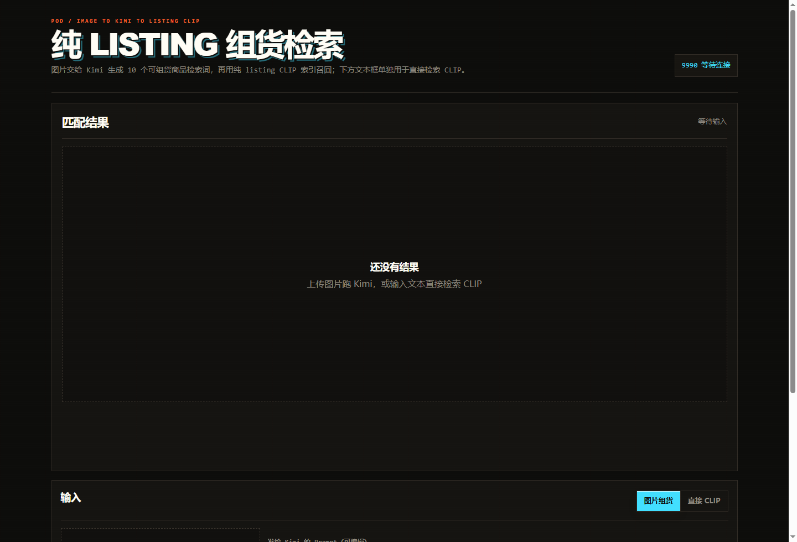
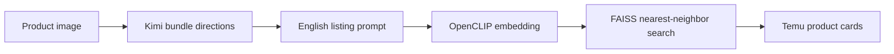

<div align="center">

# Bundle CLIP

### Temu product retrieval pack for local bundle-building workflows

<p>
  
  
  
  
</p>

**Image in. Product ideas out.**

This repository packages a local CLIP + FAISS retrieval service for ecommerce bundle discovery.

</div>

---

## Screenshots

<p align="center">
  
</p>

<p align="center">
  <em>Local listing search page served by the bundled 9990 runtime.</em>
</p>

<table>
  <tr>
    <td width="50%">
      
    </td>
    <td width="50%">
      
    </td>
  </tr>
  <tr>
    <td align="center"><strong>Smart Bundle Workflow</strong></td>
    <td align="center"><strong>Integrated Workbench</strong></td>
  </tr>
</table>

## What This Is

`bundle-clip` is a self-contained local retrieval bundle used by the Auto Bundle workbench. It combines:

| Layer | Role |
| --- | --- |
| Kimi planning | Turns an input product image into bundle-search directions. |
| OpenCLIP encoder | Embeds image and text prompts into the same semantic space. |
| FAISS listing index | Retrieves high-similarity Temu listings from the prepared metadata. |
| Local web UI | Serves a review page at `http://127.0.0.1:9990/`. |

The pack is designed for fast local review, private experimentation, and offline-ish product matching after the LFS assets are downloaded.

## Repository Layout

```text
bundle-clip/
├─ app/
│  └─ listing_search.html
├─ docs/
│  └─ images/
├─ work/
│  ├─ full_listing_server.py
│  ├─ stdio_listing_worker.py
│  ├─ full_clip_server.py
│  └─ build_full_listing_index.py
├─ models/
│  └─ open_clip_pytorch_model.bin
├─ data/
│  ├─ yunqi_clip_training/
│  │  └─ last_checkpoint.pt
│  ├─ full_listing_index/
│  │  ├─ products_listing.index
│  │  ├─ products_listing_meta.runtime.json
│  │  ├─ cleaning_report.json
│  │  └─ progress.json
│  └─ full_clip_index/
│     └─ products_full_prices.json
├─ config.example.json
├─ .gitattributes
└─ README.md
```

## Included Assets

| Asset | Purpose |
| --- | --- |
| `models/open_clip_pytorch_model.bin` | Base OpenCLIP model weights. |
| `data/yunqi_clip_training/last_checkpoint.pt` | Fine-tuned checkpoint for the bundle-search domain. |
| `data/full_listing_index/products_listing.index` | FAISS index for listing retrieval. |
| `data/full_listing_index/products_listing_meta.runtime.json` | Runtime metadata used to render product cards. |
| `data/full_clip_index/products_full_prices.json` | Price metadata used by the local search UI. |

Large files are tracked with Git LFS. Run `git lfs pull` after cloning.

## Clone & Update

Yes, you can clone this repository directly. The only catch is that the model weights and FAISS index are stored with Git LFS, so a complete first-time setup should be:

```powershell
git lfs install
git clone https://huggingface.co/mikaassa/bundle-clip
cd bundle-clip
git lfs pull
```

If Git LFS is missing, the large assets will look like tiny text pointer files and the server will fail when loading the model or index.

To update an existing local copy later:

```powershell
cd bundle-clip
git pull
git lfs pull
```

## Quick Start

### 1. Clone With LFS

```powershell
git lfs install
git clone https://huggingface.co/mikaassa/bundle-clip
cd bundle-clip
git lfs pull
```

### 2. Create Local Config

```powershell
Copy-Item config.example.json config.json
```

Fill in your private Kimi or Moonshot key:

```json
{
  "kimi": {
    "api_key": "YOUR_KIMI_API_KEY",
    "endpoint": "https://api.moonshot.cn/v1/chat/completions",
    "model": "kimi-k2.6",
    "temperature": 0.6,
    "max_completion_tokens": 1200
  }
}
```

`config.json` is ignored by Git. Keep real API keys local.

### 3. Start The Local Service

```powershell
python .\work\full_listing_server.py
```

Open:

```text
http://127.0.0.1:9990/
```

## Workflow



The local UI supports two review paths:

| Mode | Use Case |
| --- | --- |
| Image bundle search | Upload a product image, let Kimi produce bundle directions, then retrieve matching listings. |
| Direct CLIP search | Enter a manual listing keyword or prompt and search the index directly. |

## Runtime Notes

- Default local port: `9990`
- Main service entry: `work/full_listing_server.py`
- Workbench worker entry: `work/stdio_listing_worker.py`
- Public page: `app/listing_search.html`
- Main metadata image field: `MAINIMAGE`

The service prefers repository-local `data/` and `models/` paths first. Older absolute-path fallbacks are only used when local assets are missing.

## Safety

- Do not commit `config.json`, `.env`, logs, or local cache output.
- API keys should be supplied through `config.json` or environment variables only.
- This repository is a local runtime pack, not a public hosted inference endpoint.
- Product metadata and retrieval quality depend on the bundled index snapshot.

## Environment Overrides

```powershell
$env:MOONSHOT_API_KEY="YOUR_KIMI_API_KEY"
$env:KIMI_ENDPOINT="https://api.moonshot.cn/v1/chat/completions"
$env:KIMI_MODEL="kimi-k2.6"
```

## License

Released under the Apache 2.0 license. Check upstream model and data-source terms before redistribution or commercial deployment.
